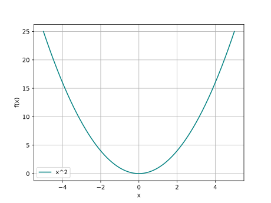
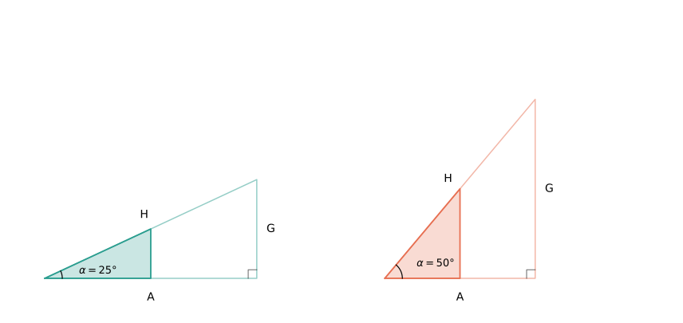

Jeder lernt ihn in der Schule, kaum jemand versteht ihn intuitiv: den Sinus. Unverzichtbar für die Naturwissenschaften, aber meistens trocken serviert. Ein Erklärungsversuch ohne Auswendiglernen.

## Die Verwirrung
Die Geometrie nutzt den Sinus für Verhältnisse im Dreieck. Die Analysis lässt ihn als abstrakte Funktion auferstehen. Die Physik beschreibt mit ihm Wellen und Schwingungen. Drei völlig unterschiedliche Gewänder für dasselbe mathematische Objekt. Wie passt das zusammen?

## Abstraktion
Im Grunde sind $sin$ und $cos$ mathematische Funktionen. Eine Funktion (oder auch Abbildung) ist eine Beziehung (Relation) zwischen zwei Mengen, die jedem Element der einen Menge ($x$) genau ein Element der anderen Menge ($f(x)$) zuordnet:

$x$ -> Funktion $f$ -> $f(x)$

## Herleitung der trigonometrischen Funktionen ($sin$ und $cos$) via Geometrie
Ein Beispiel für eine Funktion ist $f(x)=x^2$. Diese Funktion nimmt einen gewissen Input $x$, multipliziert ihn mit sich selbst und gibt das Ergebnis als Output $f(x)$. Was machen aber die trigonometrischen Funktionen mit einem beliebigen Input $x$? 

*Abbildung 1: Graph der Funktion $f(x)=x^2$*

Das Verhalten lässt sich über die Geometrie herleiten. Genauer gesagt mit Hilfe von rechtwinkligen Dreiecken.

*Abbildung 2: Zwei Dreiecke mit jeweils zwei skalierten Versionen. Innerhalb jedes Paares ist der Winkel $\alpha$ gleich, die Hypotenusen H sind in beiden Bildern gleich lang.*