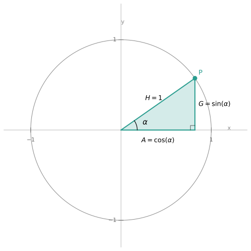
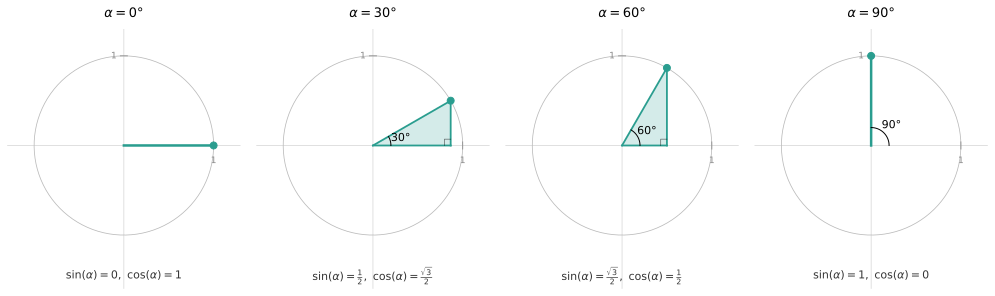
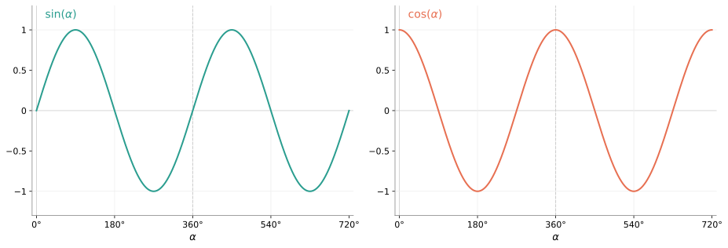
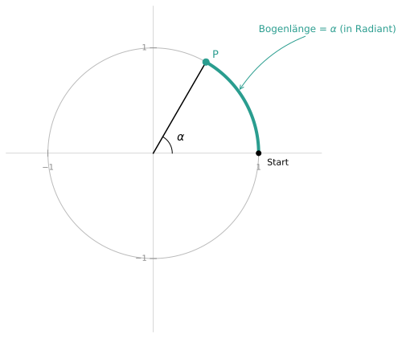
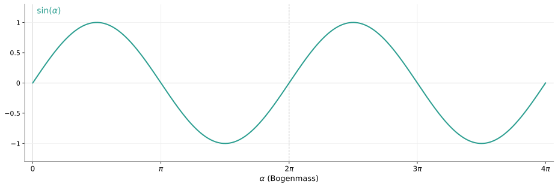
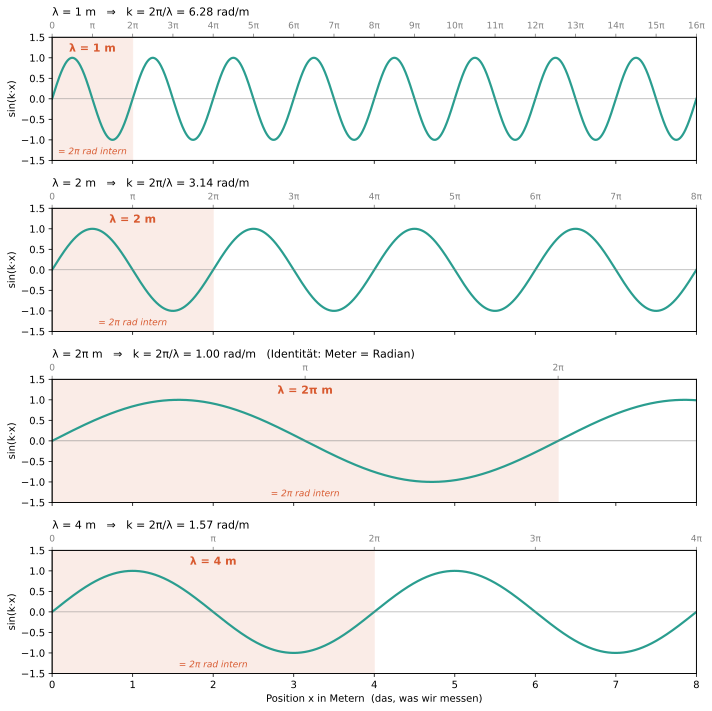

Jeder lernt ihn in der Schule, kaum jemand versteht ihn intuitiv: den Sinus. Unverzichtbar für die Naturwissenschaften, aber meistens trocken serviert. Ein Erklärungsversuch ohne Auswendiglernen.

## Die Verwirrung
Die Geometrie nutzt den Sinus für Verhältnisse im Dreieck. Die Analysis lässt ihn als abstrakte Funktion auferstehen. Die Physik beschreibt mit ihm Wellen und Schwingungen. Drei völlig unterschiedliche Gewänder für dasselbe mathematische Objekt. Wie passt das zusammen?

## Abstraktion
Im Grunde sind $\sin$ und $\cos$ mathematische Funktionen. Eine Funktion (oder auch Abbildung) ist eine Beziehung (Relation) zwischen zwei Mengen, die jedem Element der einen Menge ($x$) genau ein Element der anderen Menge ($f(x)$) zuordnet:

$x \to f \to f(x)$

## Herleitung der trigonometrischen Funktionen ($\sin$ und $\cos$) durch Geometrie
Ein Beispiel für eine Funktion ist $f(x)=x^2$. Diese Funktion nimmt einen gewissen Input $x$, multipliziert ihn mit sich selbst und gibt das Ergebnis als Output $f(x)$. Was machen aber die trigonometrischen Funktionen mit einem beliebigen Input $x$?

*Abbildung 1: Graph der Funktion $f(x)=x^2$*

Das Verhalten lässt sich über die Geometrie herleiten. Genauer gesagt mit Hilfe von rechtwinkligen Dreiecken.

*Abbildung 2: Zwei Dreiecke mit jeweils zwei skalierten Versionen. Innerhalb jedes Paares ist der Winkel $\alpha$ gleich, die Hypotenusen H sind in beiden Bildern gleich lang.*

Wenn man nun die Verhältnisse von $\frac{A}{H}$ und $\frac{G}{H}$ betrachtet, ist ersichtlich, dass die Verhältnisse lediglich vom Winkel $\alpha$ abhängig sind. In anderen Worten: Bei rechtwinkligen Dreiecken ändern sich die beschriebenen Verhältnisse von Ankathete, beziehungsweise von Gegenkathete zu Hypotenuse, nicht mit der Grösse der Dreiecke, sofern der Winkel $\alpha$ konstant gehalten wird. Diese geometrische Tatsache erlaubt uns, diese Verhältnisse als Funktionen von $\alpha$ zu schreiben:

$
f(\alpha)=\frac{A}{H}=\cos(\alpha)
$

analog:

$
f(\alpha)=\frac{G}{H}=\sin(\alpha)
$.

> $\sin$ und $\cos$ sind nichts anderes als Namen für die diskutierten Verhältnisse/Funktionen.

Wenn man nun ein rechtwinkliges Dreieck im Einheitskreis betrachtet, sprich die Hypotenuse die Länge 1 hat, vereinfachen sich die Funktionen für Sinus und Cosinus folgendermassen:

$
\cos(\alpha)=\frac{A}{H}=\frac{A}{1}=A
$

und

$
\sin(\alpha)=\frac{G}{H}=\frac{G}{1}=G
$.

*Abbildung 3: Rechtwinkliges Dreieck im Einheitskreis*

Wenn man nun den Winkel $\alpha$ von $0 - 360\degree$ rotieren lässt, erzeugt man alle möglichen rechtwinkligen Dreiecke mit $H=1$. Der $\sin(\alpha)$ ist also definiert als die Länge der Gegenkathete, wenn $H=1$, bei einem beliebigen Winkel $\alpha$. Der $\cos(\alpha)$ als Länge der Ankathete.

*Abbildung 4: Rechtwinklige Dreiecke mit verschiedenen Winkeln*

Die Wertetabelle lässt sich somit folgendermassen definieren:

| $\alpha$       | $0°$ | $45°$                  | $90°$ | $135°$                  | $180°$ | $225°$                   | $270°$ | $315°$                   | $360°$ | $\ldots$ |
|----------------|------|------------------------|-------|-------------------------|--------|--------------------------|--------|--------------------------|--------|----------|
| $\sin(\alpha)$ | $0$  | $\tfrac{\sqrt{2}}{2}$  | $1$   | $\tfrac{\sqrt{2}}{2}$   | $0$    | $-\tfrac{\sqrt{2}}{2}$   | $-1$   | $-\tfrac{\sqrt{2}}{2}$   | $0$    | $\ldots$ |
| $\cos(\alpha)$ | $1$  | $\tfrac{\sqrt{2}}{2}$  | $0$   | $-\tfrac{\sqrt{2}}{2}$  | $-1$   | $-\tfrac{\sqrt{2}}{2}$   | $0$    | $\tfrac{\sqrt{2}}{2}$    | $1$    | $\ldots$ |

Mithilfe der Wertetabelle können wir die Graphen der trigonometrischen Funktionen plotten.

*Abbildung 5: Funktionsgraphen von Sinus und Cosinus*

Nach $360°$ wiederholen sich die Funktionen. Das macht intuitiv Sinn, denn $\alpha$ und $\alpha + 360°$ beschreiben im Einheitskreis denselben Punkt — wir sind einmal komplett herumgegangen und wieder am Anfang. Formal heisst das:

$$\sin(\alpha) = \sin(\alpha + 360°) \qquad \cos(\alpha) = \cos(\alpha + 360°)$$

Diese Eigenschaft nennt man **Periodizität**, und $360°$ ist die *Periode* der beiden Funktionen.

Wir haben $\sin(\alpha)$ und $\cos(\alpha)$ als geometrische Grössen hergeleitet: man steckt einen Winkel rein, bekommt eine Länge zwischen $-1$ und $1$ zurück, nämlich die Länge der Ankathete oder Gegenkathete im Einheitskreis.

Diese geometrische Bedeutung können wir aber auch fallen lassen. Abstrakt betrachtet sind $\sin$ und $\cos$ einfach Funktionen, die jeder reellen Zahl einen Wert zwischen $-1$ und $1$ zuordnen:

$$\sin: \mathbb{R} \rightarrow [-1, 1]$$

$$\cos: \mathbb{R} \rightarrow [-1, 1]$$

Was wir reinstecken, ist dann kein Winkel mehr — einfach eine Zahl. Was wir rausbekommen, ist auch keine Länge mehr — einfach eine Zahl. Die geometrische Lesart bleibt möglich, ist aber nicht zwingend. Wenn wir $\sin(2)$ ausrechnen, müssen wir uns kein Dreieck mehr vorstellen. Wir können es, wenn es hilft — aber die Funktion existiert auch ohne.

Diese Abstraktion ist nicht l'art pour l'art. Sie wird wichtig, sobald wir $\sin$ und $\cos$ in einem anderen Kontext brauchen — zum Beispiel, um eine räumliche Welle zu beschreiben.

## Mögliche Anwendung von trigonometrischen Funktionen in Naturwissenschaften
In den Naturwissenschaften werden die trigonometrischen Funktionen aufgrund ihrer Eigenschaften ("Welligkeit", Periodizität) zum Beschreiben verschiedenster Wellen (Wasserwellen, Schallwellen, elektromagnetische Wellen, usw.) verwendet. Um eine räumliche Welle zu beschreiben, benötigen wir eine Funktion, welche als Input eine Position $x$ nimmt und als Output einen Wert liefert, welcher beschreibt, wie hoch die Welle $f(x)$ an gegebener Position ist. Die Frage, welche sich jetzt stellt, ist, wie man nun von der Funktion $\sin(\alpha)$ zu einer Funktion von der Form $\sin(x)$ kommt.
Hierfür benötigt man das Bogenmass. Das Bogenmass ist ein alternatives Winkelmass, bei dem ein Winkel durch die Länge des entsprechenden Kreisbogens auf dem Einheitskreis angegeben wird. Eine volle Umdrehung ($360\degree$) hat die Bogenlänge $U=2 \pi r$, also beträgt der Vollwinkel $2 \pi$ $\mathrm{rad}$. Es gilt somit $2 \pi$ $\mathrm{rad}=360\degree$.

*Abbildung 6: Das Bogenmass. Der Winkel im Bogenmass ist die Länge des Bogens auf dem Einheitskreis.*

Im Grunde passiert immer noch das Gleiche. Man gibt als Input einen Winkel (als eine Länge ausgedrückt) und erhält mit dem $\sin$ die Länge der korrespondierenden Gegenkathete.

*Abbildung 7: Funktionsgraph Sinus im Bogenmass*

Man darf sich nun den Graph als Ausdehnung einer Welle im Raum vorstellen. Die x-Achse entspricht der räumlichen Ausdehnung in x-Richtung, die y-Achse der Auslenkung der Welle. Aktuell ist die x-Achse aber noch in **Radian** skaliert (eine volle Wellenlänge $\lambda$ entspricht $2\pi$), und die Auslenkung liegt zwischen $-1$ und $1$. Beides ohne physikalische Einheit. Im nächsten Schritt wollen wir die x-Achse in Metern interpretieren und die Auslenkung in der passenden physikalischen Grösse (z. B. Metern bei einer Wasserwelle).

Die x-Achse interpretiert man nun als Meter. $2 \pi$ wird somit zu $2 \pi$m $\approx 6.28$m. Das entspricht einer Wellenlänge von $\lambda=6.28$m. Eine Wasserwelle hat vielleicht $\lambda=3$m, eine Lichtwelle vielleicht $\lambda=500$nm. Der Sinus rechnet intern weiterhin mit Radian. Man möchte aber Meter als Input geben. Man braucht also einen Faktor $k$, welcher den Input von Meter in Radian umrechnet. Wenn man in Meter eine ganze Wellenlänge vorrückt, soll der Sinus eine ganze Periode ($2 \pi$ $\mathrm{rad}$) durchlaufen haben. Übersetzt in eine Gleichung ergibt das:

$k \lambda = 2 \pi$

Links steht: "Meter-Wegstrecke $\lambda$ wird mit $k$ in Radian umgerechnet." Rechts steht: "Soll genau eine volle Periode $2 \pi$ ergeben." Aufgelöst nach $k$ ergibt sich:

$k=\frac{2 \pi}{\lambda}$

Für die Auslenkung reicht es, die Funktion mit einer Amplitude $A_0$ zu multiplizieren. Es resultiert somit die Gleichung für eine räumliche Welle:

$f(x)=A_0 \sin(kx)=A_0 \sin(\frac{2 \pi}{\lambda}x)$,

wobei $[A_0] = \mathrm{m}$, $[k] = \mathrm{rad/m}$, $[\lambda] = \mathrm{m}$ und $[x] = \mathrm{m}$.

Damit ist das Argument des Sinus $[kx] = \mathrm{rad}$ (also dimensionslos), und der Funktionswert $[f(x)] = \mathrm{m}$.

*Abbildung 8: Wellenzahl $k$: Übersetzer zwischen Meter-Welt (unten) und Radian-Welt (oben)*