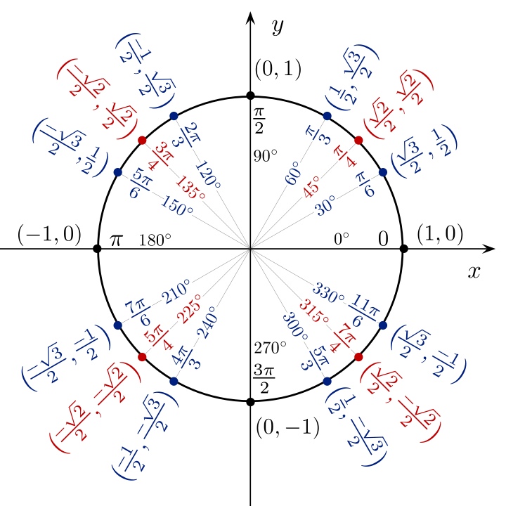
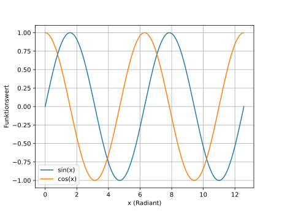

Sin, cos und tan sind doch eigentlich nur Verhältnisse in einem Dreieck. 
Aber wie kommt man dann zur klassischen Sinuskurve, die hoch und runter wellt? 
Diese Frage hat mich lange beschäftigt.

## Inline-Mathematik

Im Text kann man Formeln so einbetten: $\sin^2(x) + \cos^2(x) = 1$. Das ist 
der Trigonometrische Pythagoras, und er gilt für jedes $x$.

## Block-Mathematik

Grössere Formeln stehen als eigener Block:

$$
\sin(x) = x - \frac{x^3}{3!} + \frac{x^5}{5!} - \frac{x^7}{7!} + \ldots
$$

Das ist die Taylor-Reihe von Sinus. Sie zeigt, dass sin als Polynom 
mit unendlich vielen Termen geschrieben werden kann.

Oder noch komplexer, eine Definition über ein Integral:

$$
\sin(x) = \int_0^x \cos(t) \, dt
$$


## Ein Bild einbinden

Bilder legst du in `src/assets/` ab und referenzierst sie:



Bildunterschriften kannst du mit einem kursiven Absatz darunter setzen.

*Abbildung 1: Der Einheitskreis. Der Punkt P läuft auf dem Kreis, seine 
y-Koordinate ist sin(α), seine x-Koordinate ist cos(α).*


## Code-Blöcke

Wenn du den Plot selbst berechnen lassen willst, etwa in Python:

```python
import numpy as np
import matplotlib.pyplot as plt

x = np.linspace(0, 4 * np.pi, 500)
plt.plot(x, np.sin(x), label='sin(x)')
plt.plot(x, np.cos(x), label='cos(x)')
plt.xlabel('x (Radiant)')
plt.ylabel('Funktionswert')
plt.legend()
plt.grid(True)
plt.savefig('sin_cos_plot.svg')
```



*Abbildung 2: Graph von Sinus und Cosinus*

## Hervorhebungen

Wichtige Aussagen kann man als Blockquote setzen:

> Sin ist nicht ein Verhältnis. Sin ist eine Funktion. Verhältnisse sind 
> nur eine *Anwendung* dieser Funktion.

Oder als fett markierten Satz: **Die Welle ist nicht sin. Die Welle ist 
der Graph von sin.**

## Listen

Wo sin in der Welt auftaucht:

- Federpendel: Auslenkung über die Zeit
- Wechselstrom: Spannung über die Zeit
- Schall- und Lichtwellen
- Fourier-Zerlegung beliebiger Signale

## Tabellen

| $x$       | $\sin(x)$ | $\cos(x)$ |
|---------|--------|--------|
| $0$       | $0$     | $1$      |
| $\frac{\pi}{6}$     | $0.5$    | $0.866$  |
| $\frac{\pi}{4}$     | $0.707$  | $0.707$  |
| $\frac{\pi}{3}$     | $0.866$  | $0.5$    |
| $\frac{\pi}{2}$     | $1$     | $0$      |


## Fazit

Das war ein Demo-Artikel – Inhalt ist Platzhalter. Was hier zu sehen ist:
Inline-Mathe, Block-Mathe, Bilder, Code, Blockquotes, Tabellen, Listen.